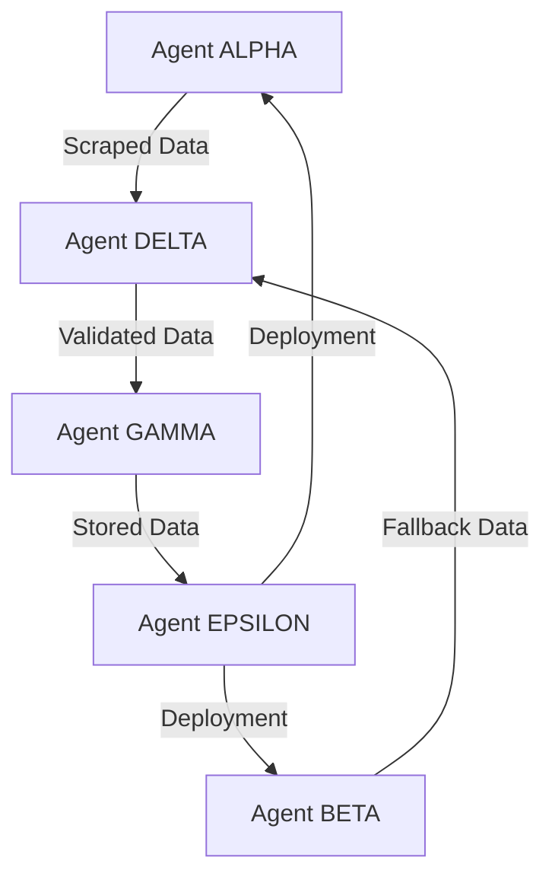

# AI Agent Workflow Guide
## Efficient Development Process for Copilot Agents

---

## 🚀 Quick Start

### 1. **Receive Task**
- Check GitHub Issues for assigned tasks
- Read task requirements thoroughly
- Clarify any ambiguities before starting

### 2. **Plan Approach**
- Break task into subtasks
- Identify dependencies
- Estimate time needed

### 3. **Create Branch**
```bash
git checkout main
git pull origin main
git checkout -b copilot/agent-<agent-name>-<issue-number>-<brief-description>

# Examples:
# git checkout -b copilot/agent-alpha-1-fix-api-scraper
# git checkout -b copilot/agent-gamma-3-database-schema
```

### 4. **Implement**
- Write code following project conventions
- Add tests as you go
- Document complex logic

### 5. **Test**
```bash
# Run unit tests
pytest tests/unit/ -v

# Run integration tests
pytest tests/integration/ -v

# Run specific test file
pytest tests/unit/test_api_scraper.py -v

# Check coverage
pytest --cov=src --cov-report=html
```

### 6. **Commit**
```bash
git add .
git commit -m "[AGENT] Issue #N: Brief description

Detailed changes:
- Change 1
- Change 2
- Change 3

Testing:
- Test scenario 1: passed
- Test scenario 2: passed

Relates to #N"
```

### 7. **Push & Create PR**
```bash
git push origin copilot/agent-<agent-name>-<issue-number>-<brief-description>

# Create PR via GitHub CLI
gh pr create \
  --title "[AGENT] Issue #N: Brief description" \
  --body-file .github/PULL_REQUEST_TEMPLATE.md \
  --base main
```

### 8. **Address Review Comments**
- Respond to all comments
- Make requested changes
- Push updates to same branch

### 9. **Merge**
- Once approved and CI passes, squash merge
- Delete branch after merge

---

## 🧩 Agent-Specific Workflows

### Agent ALPHA (API Scraping)

#### Development Checklist
- [ ] Session management implemented
- [ ] Headers properly configured
- [ ] Error handling with retries
- [ ] Response validation
- [ ] Rate limiting implemented
- [ ] Logging added
- [ ] Unit tests written
- [ ] Integration test with real API

#### Testing Requirements
```python
# tests/unit/test_api_scraper.py
def test_session_establishment():
    """Test that session is properly established"""
    
def test_headers_complete():
    """Test all required headers are present"""
    
def test_json_parsing():
    """Test JSON response parsing"""
    
def test_error_handling():
    """Test error scenarios"""
    
def test_retry_logic():
    """Test retry with exponential backoff"""
```

#### Performance Targets
- Success rate: >90%
- Response time: <3s per request
- Error rate: <5%
- No 403 errors

---

### Agent BETA (Selenium/Browser Automation)

#### Development Checklist
- [ ] Wait strategies implemented (explicit waits)
- [ ] undetected-chromedriver configured
- [ ] Human-like delays added
- [ ] Window/tab switching handled
- [ ] JavaScript execution working
- [ ] Screenshots on error
- [ ] Browser cleanup on exit
- [ ] Headless mode option

#### Testing Requirements
```python
# tests/unit/test_selenium_scraper.py
def test_wait_for_data_load():
    """Test waiting for dynamic content"""
    
def test_window_switching():
    """Test switching between windows"""
    
def test_javascript_execution():
    """Test JS execution and response"""
    
def test_element_extraction():
    """Test data extraction from elements"""
    
def test_error_screenshot():
    """Test screenshot capture on error"""
```

#### Performance Targets
- Success rate: >95%
- Page load time: <10s
- Element wait timeout: 20s
- Memory cleanup: 100%

---

### Agent GAMMA (Database)

#### Development Checklist
- [ ] SQLAlchemy models defined
- [ ] Relationships configured
- [ ] Indexes created
- [ ] Constraints added
- [ ] Migration scripts written
- [ ] Connection pooling configured
- [ ] Transaction management
- [ ] Error handling

#### Testing Requirements
```python
# tests/unit/test_database_models.py
def test_tender_model_creation():
    """Test tender model CRUD operations"""
    
def test_relationships():
    """Test model relationships"""
    
def test_unique_constraints():
    """Test unique constraint enforcement"""
    
def test_cascade_delete():
    """Test cascade deletion"""
    
def test_connection_pool():
    """Test connection pooling"""
```

#### Performance Targets
- Query time: <100ms for simple queries
- Bulk insert: >100 records/second
- Connection pool: 5-20 connections
- Transaction rollback: 100% successful

---

### Agent DELTA (Pipeline/Orchestration)

#### Development Checklist
- [ ] Pipeline stages defined
- [ ] Error handling at each stage
- [ ] Retry logic implemented
- [ ] Progress tracking
- [ ] Summary reporting
- [ ] Logging comprehensive
- [ ] Unit tests for each stage
- [ ] Full integration test

#### Testing Requirements
```python
# tests/unit/test_orchestrator.py
def test_pipeline_happy_path():
    """Test full pipeline success"""
    
def test_stage_failure_recovery():
    """Test recovery from stage failure"""
    
def test_retry_logic():
    """Test retry mechanism"""
    
def test_progress_tracking():
    """Test progress is tracked correctly"""
    
def test_summary_report():
    """Test summary report generation"""
```

#### Performance Targets
- Pipeline completion: <30 minutes for 100 tenders
- Error recovery rate: >90%
- Logging coverage: 100% of stages
- Test coverage: >70%

---

### Agent EPSILON (DevOps/Infrastructure)

#### Development Checklist
- [ ] Deployment script tested
- [ ] Environment variables configured
- [ ] Cron job scheduled
- [ ] Log rotation configured
- [ ] Health check endpoint
- [ ] Monitoring alerts set up
- [ ] Backup strategy implemented
- [ ] Documentation updated

#### Testing Requirements
```bash
# Manual testing checklist
□ SSH into EC2 instance
□ Run deployment script
□ Verify all dependencies installed
□ Test cron job execution
□ Check log files
□ Verify health check endpoint
□ Test alert notifications
□ Verify backup creation
```

#### Performance Targets
- Deployment time: <10 minutes
- Zero downtime deployments
- Log retention: 30 days
- Alert latency: <5 minutes

---

## 💬 Communication Protocols

### Daily Status Update Format

```markdown
**Agent:** [AGENT_NAME]
**Date:** YYYY-MM-DD

**✅ Completed:**
- Issue #X: Description (PR #Y merged)

**🔄 In Progress:**
- Issue #Z: Description (60% complete)
  - Completed: Subtask A, B
  - Remaining: Subtask C, D

**🚧 Blockers:**
- Waiting for database schema from Agent GAMMA
- Need clarification on requirement X

**📅 Next:**
- Continue Issue #Z
- Start Issue #W tomorrow
```

### PR Review Comment Format

```markdown
**Reviewer:** [Your name]
**Agent:** [AGENT_NAME]

**✅ Strengths:**
- Good error handling
- Comprehensive tests
- Clear documentation

**🔧 Requested Changes:**
1. **Line 45:** Add input validation for `tender_id`
2. **Line 78:** Use parameterized query instead of f-string
3. **tests/**: Add test case for edge case X

**❓ Questions:**
- Why was approach X chosen over Y?
- Have you tested this on production-like data?

**⚡ Suggestions (Optional):**
- Consider using a context manager for the connection
- Could refactor function Z for better readability
```

---

## 🧪 Testing Standards

### Test Coverage Requirements
- **Unit tests:** >70% code coverage
- **Integration tests:** All critical paths
- **Manual tests:** Document in PR

### Test Naming Convention
```python
def test_<function_name>_<scenario>_<expected_result>():
    """Test that <function> does <what> when <condition>"""
    # Arrange
    # Act
    # Assert
    
# Examples:
def test_api_scraper_session_valid_returns_200():
    """Test that API scraper returns 200 with valid session"""
    
def test_database_insert_duplicate_raises_exception():
    """Test that inserting duplicate tender raises IntegrityError"""
```

### Test Structure (AAA Pattern)
```python
def test_example():
    """Test description"""
    
    # Arrange - Set up test data and dependencies
    scraper = APIScraper()
    test_data = {...}
    
    # Act - Execute the function being tested
    result = scraper.scrape(test_data)
    
    # Assert - Verify the result
    assert result.status_code == 200
    assert len(result.tenders) > 0
```

---

## 🔒 Security Best Practices

### Code Review Checklist
- [ ] No hardcoded credentials
- [ ] All inputs validated
- [ ] SQL injection prevention (parameterized queries)
- [ ] XSS prevention (sanitize output)
- [ ] Path traversal prevention
- [ ] Secure file handling
- [ ] Proper error messages (no info leakage)
- [ ] Logging doesn't include sensitive data

### Secrets Management
```python
# ❌ BAD
api_key = "abc123xyz"

# ✅ GOOD
import os
api_key = os.getenv("API_KEY")
if not api_key:
    raise ValueError("API_KEY environment variable not set")
```

---

## 📊 Performance Guidelines

### Optimization Checklist
- [ ] Database queries use indexes
- [ ] N+1 query problem avoided
- [ ] Caching implemented where appropriate
- [ ] Connection pooling used
- [ ] Batch operations for bulk data
- [ ] Async/parallel processing where possible
- [ ] Memory usage monitored
- [ ] Resource cleanup (connections, file handles)

### Performance Testing
```python
import time
from memory_profiler import profile

@profile
def test_performance():
    """Test function performance"""
    start = time.time()
    
    # Run function
    result = function_under_test()
    
    elapsed = time.time() - start
    assert elapsed < 3.0  # Should complete in <3s
```

---

## 🐛 Debugging Tips

### Enable Debug Logging
```python
import logging
logging.basicConfig(level=logging.DEBUG)
logger = logging.getLogger(__name__)

logger.debug("Debug info: %s", variable)
```

### Interactive Debugging
```python
# Add breakpoint
import pdb; pdb.set_trace()

# Or use pytest with debugger
pytest tests/unit/test_api_scraper.py -v --pdb
```

### Common Issues

#### Issue: Tests fail locally but pass in CI
- Check Python version
- Check installed dependencies
- Check environment variables
- Check file paths (use absolute paths)

#### Issue: Scraper gets 403 errors
- Verify session establishment
- Check all headers
- Test rate limiting
- Verify user agent

#### Issue: Database connection fails
- Check connection string
- Verify database is running
- Check firewall rules
- Test credentials

---

## 📚 Code Style Guide

### Python Conventions
```python
# Imports
import os
from typing import List, Dict, Optional

# Constants
MAX_RETRIES = 3
DEFAULT_TIMEOUT = 30

# Class naming
class TenderScraper:
    """Scraper for tender data"""
    
    def __init__(self, config: Dict):
        """Initialize scraper with config"""
        self.config = config
        
    def scrape_tenders(self, start_date: str) -> List[Dict]:
        """
        Scrape tenders from start_date onwards
        
        Args:
            start_date: Date in YYYY-MM-DD format
            
        Returns:
            List of tender dictionaries
            
        Raises:
            ScraperException: If scraping fails
        """
        pass
```

### Documentation
```python
def complex_function(param1: str, param2: int = 10) -> Dict:
    """
    One-line summary of function.
    
    Detailed description of what the function does,
    including any important implementation details.
    
    Args:
        param1: Description of param1
        param2: Description of param2 (default: 10)
        
    Returns:
        Dictionary containing:
            - key1: Description
            - key2: Description
            
    Raises:
        ValueError: If param1 is invalid
        RuntimeError: If operation fails
        
    Example:
        >>> result = complex_function("test", 5)
        >>> print(result)
        {'key1': 'value1', 'key2': 'value2'}
    """
    pass
```

---

## 🎯 Agent Collaboration

### Cross-Agent Dependencies



### Handoff Checklist

When passing work to another agent:
- [ ] Code is committed and pushed
- [ ] Tests pass locally
- [ ] Documentation updated
- [ ] PR created with clear description
- [ ] Dependencies documented
- [ ] Next agent notified via issue comment

---

## 🚀 Quick Reference

### Essential Commands
```bash
# Development
git checkout -b copilot/agent-X-issue-N-description
pytest tests/ -v
pytest --cov=src

# Commit
git add .
git commit -m "[AGENT] Issue #N: Description"

# PR
git push origin branch-name
gh pr create --title "..." --body-file .github/PULL_REQUEST_TEMPLATE.md

# Merge latest main
git checkout main
git pull origin main
git checkout your-branch
git merge main
```

### Useful GitHub CLI Commands
```bash
# View your open issues
gh issue list --assignee @me

# View PR status
gh pr status

# View PR checks
gh pr checks

# Merge PR
gh pr merge --squash
```

---

**Remember:** Quality > Speed. Write tests, document your code, and communicate clearly! 🚀

