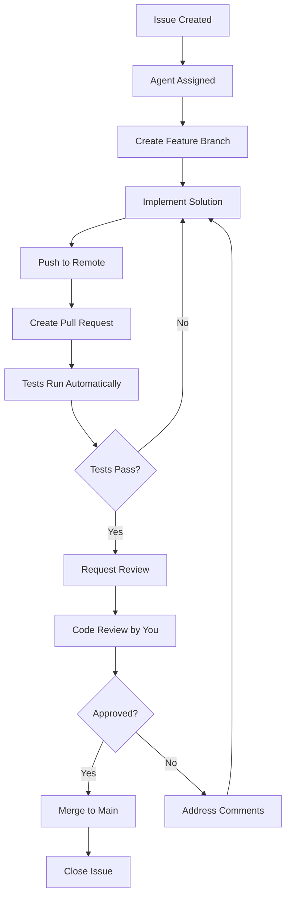

# 🔧 GITHUB REPOSITORY SETUP GUIDE
## Branch Protection Rules & PR Workflow

---

## 📋 COMPLETE SETUP CHECKLIST

### ✅ Part 1: Repository Structure (15 minutes)
### ✅ Part 2: Branch Protection Rules (10 minutes)
### ✅ Part 3: PR Templates (10 minutes)
### ✅ Part 4: GitHub Actions (15 minutes)
### ✅ Part 5: Agent Workflow (5 minutes)

---

## 📁 PART 1: REPOSITORY STRUCTURE SETUP

### **Step 1: Create Branch Structure**

```bash
# Clone your repo (if not already)
git clone https://github.com/vinaybeerelli/tender360-scrape-application.git
cd tender360-scrape-application

# Create and push develop branch
git checkout -b develop
git push -u origin develop

# Go back to main
git checkout main
```

**Branch Strategy:**
```
main (production)
  ↑ (PR only)
develop (staging)
  ↑ (PR only)
feature/issue-X-description (working branches)
```

### **Step 2: Create Directory Structure**

```bash
# Create complete project structure
mkdir -p .github/{workflows,ISSUE_TEMPLATE,PULL_REQUEST_TEMPLATE}
mkdir -p src/{scrapers,database,services,pipeline,utils}
mkdir -p config tests/{unit,integration,fixtures} scripts docs
mkdir -p data/{logs,downloads,backups}

# Create __init__.py files
touch src/__init__.py
touch src/scrapers/__init__.py
touch src/database/__init__.py
touch src/services/__init__.py
touch src/pipeline/__init__.py
touch src/utils/__init__.py
touch tests/__init__.py
touch config/__init__.py

# Create .gitkeep for empty directories
touch data/.gitkeep
touch data/logs/.gitkeep
touch data/downloads/.gitkeep
touch data/backups/.gitkeep
```

### **Step 3: Create Essential Files**

**Create: `.gitignore`**
```bash
cat > .gitignore << 'EOF'
# Python
__pycache__/
*.py[cod]
*$py.class
*.so
.Python
build/
dist/
*.egg-info/
.venv/
venv/
env/

# IDE
.vscode/
.idea/
*.swp

# Environment
.env
.env.local

# Data
data/logs/*.log
data/downloads/*
data/backups/*
*.db
*.sqlite

# Keep structure
!data/.gitkeep
!data/logs/.gitkeep
!data/downloads/.gitkeep
!data/backups/.gitkeep

# Testing
.pytest_cache/
.coverage
htmlcov/

# OS
.DS_Store
Thumbs.db
EOF
```

**Create: `requirements.txt`**
```bash
cat > requirements.txt << 'EOF'
# Core dependencies
requests==2.31.0
beautifulsoup4==4.12.2
lxml==4.9.3
selenium==4.15.2
undetected-chromedriver==3.5.4

# Database
sqlalchemy==2.0.23

# Document processing
PyPDF2==3.0.1
pdfplumber==0.10.3
python-docx==1.1.0
openpyxl==3.1.2
pandas==2.1.4

# Utilities
python-dotenv==1.0.0
python-dateutil==2.8.2

# Web framework
fastapi==0.104.1
uvicorn==0.24.0
EOF
```

**Create: `requirements-dev.txt`**
```bash
cat > requirements-dev.txt << 'EOF'
-r requirements.txt

# Testing
pytest==7.4.3
pytest-cov==4.1.0
pytest-mock==3.12.0

# Code quality
black==23.12.1
flake8==6.1.0
isort==5.13.2
EOF
```

**Create: `.env.example`**
```bash
cat > .env.example << 'EOF'
# Database
DATABASE_URL=sqlite:///data/tender_scraper.db

# Scraper Configuration
BASE_URL=https://tender.telangana.gov.in
SCRAPER_MODE=api
HEADLESS=true
MAX_RETRIES=3

# Rate Limiting
MIN_DELAY=2
MAX_DELAY=5

# Logging
LOG_LEVEL=INFO
LOG_FILE=data/logs/scraper.log

# AWS (Optional)
AWS_REGION=ap-south-1
EOF
```

**Create: `README.md`**
```bash
cat > README.md << 'EOF'
# 🎯 Tender Scraper Engine

Automated extraction system for Telangana eTender portal data.

## 🚀 Quick Start

```bash
# Clone repository
git clone https://github.com/vinaybeerelli/tender360-scrape-application.git
cd tender360-scrape-application

# Setup virtual environment
python3 -m venv venv
source venv/bin/activate

# Install dependencies
pip install -r requirements.txt

# Configure environment
cp .env.example .env

# Run scraper
python main.py --limit 10
```

## 📚 Documentation

- [Setup Guide](docs/01_SETUP.md)
- [Architecture](docs/02_ARCHITECTURE.md)
- [Contributing Guidelines](CONTRIBUTING.md)

## 🤖 AI Agent Team

This project uses AI agents for development:
- Agent ALPHA: API Scraping
- Agent BETA: Browser Automation
- Agent GAMMA: Database & Services
- Agent DELTA: Pipeline & Testing
- Agent EPSILON: DevOps

## 📊 Project Status

Sprint 1: Foundation (In Progress)

## 📝 License

MIT License
EOF
```

**Commit Initial Structure:**
```bash
git add .
git commit -m "Initial project structure and configuration"
git push origin main
```

---

## 🔒 PART 2: BRANCH PROTECTION RULES

### **Step 1: Protect Main Branch**

**Go to Repository Settings:**
```
https://github.com/vinaybeerelli/tender360-scrape-application/settings/branches
```

**Click "Add branch protection rule"**

**Branch name pattern:** `main`

**Enable these settings:**

```
☑️ Require a pull request before merging
   ☑️ Require approvals: 1
   ☑️ Dismiss stale pull request approvals when new commits are pushed
   ☑️ Require review from Code Owners (optional)

☑️ Require status checks to pass before merging
   ☑️ Require branches to be up to date before merging
   Status checks (select after creating GitHub Actions):
      - tests (once you create test workflow)
      - lint (once you create lint workflow)

☑️ Require conversation resolution before merging

☑️ Require linear history (keeps git history clean)

☑️ Do not allow bypassing the above settings
   Exception: Include administrators (UNCHECK this)
   
☑️ Restrict who can push to matching branches
   Add: vinaybeerelli (only you can approve)

☑️ Allow force pushes
   UNCHECK (prevent force push)

☑️ Allow deletions
   UNCHECK (prevent branch deletion)
```

**Click "Create" to save**

### **Step 2: Protect Develop Branch (Optional)**

**Add another rule:**

**Branch name pattern:** `develop`

**Enable these settings:**
```
☑️ Require a pull request before merging
   ☑️ Require approvals: 1

☑️ Require status checks to pass before merging

☑️ Do not allow bypassing the above settings
```

---

## 📝 PART 3: PULL REQUEST TEMPLATES

### **Step 1: Create PR Template**

**Create: `.github/PULL_REQUEST_TEMPLATE.md`**

```bash
cat > .github/PULL_REQUEST_TEMPLATE.md << 'EOF'
## 📋 Pull Request

### Issue
Closes #(issue number)

### Agent
- [ ] Agent ALPHA (API Scraping)
- [ ] Agent BETA (Browser Automation)
- [ ] Agent GAMMA (Database)
- [ ] Agent DELTA (Pipeline/Testing)
- [ ] Agent EPSILON (DevOps)

### Type of Change
- [ ] 🐛 Bug fix (non-breaking change which fixes an issue)
- [ ] ✨ New feature (non-breaking change which adds functionality)
- [ ] 💥 Breaking change (fix or feature that would cause existing functionality to not work as expected)
- [ ] 📝 Documentation update
- [ ] 🔧 Configuration change
- [ ] 🧪 Test update

### Description
**What does this PR do?**
<!-- Provide a clear and concise description -->

**Why is this change needed?**
<!-- Explain the motivation -->

**How was this tested?**
<!-- Describe the testing process -->

### Changes Made
- [ ] Added/Modified file X
- [ ] Updated documentation
- [ ] Added tests

### Testing Checklist
- [ ] ✅ Tested locally
- [ ] ✅ All unit tests passing
- [ ] ✅ No new linting errors
- [ ] ✅ Tested on AWS Mumbai (if applicable)
- [ ] ✅ Manual testing completed

### Code Quality Checklist
- [ ] ✅ Code follows project style guidelines
- [ ] ✅ Self-review completed
- [ ] ✅ Comments added for complex logic
- [ ] ✅ Documentation updated
- [ ] ✅ No console.log or debug statements left

### Database Changes
- [ ] No database changes
- [ ] Schema changes documented
- [ ] Migration script included

### Performance Impact
- [ ] No performance impact
- [ ] Performance improved
- [ ] Potential performance impact (explain below)

### Security Considerations
- [ ] No security implications
- [ ] Security review completed
- [ ] Secrets/credentials properly handled

### Screenshots (if applicable)
<!-- Add screenshots for UI changes -->

### Additional Notes
<!-- Any other information that reviewers should know -->

### Reviewer Notes
**For @vinaybeerelli:**
<!-- Specific areas that need attention -->

---

**Before submitting:**
- [ ] Branch is up to date with main
- [ ] All checkboxes above are completed
- [ ] PR title follows format: `[AGENT] Issue #X: Brief description`
EOF
```

### **Step 2: Create Issue Templates**

**Create: `.github/ISSUE_TEMPLATE/bug_report.md`**

```bash
cat > .github/ISSUE_TEMPLATE/bug_report.md << 'EOF'
---
name: Bug Report
about: Report a bug or issue
title: '[BUG] '
labels: bug
assignees: vinaybeerelli
---

## 🐛 Bug Report

### Description
<!-- Clear description of the bug -->

### Steps to Reproduce
1. 
2. 
3. 

### Expected Behavior
<!-- What should happen -->

### Actual Behavior
<!-- What actually happens -->

### Error Messages
```
<!-- Paste error messages here -->
```

### Environment
- OS: [e.g., Ubuntu 22.04]
- Python Version: [e.g., 3.10.12]
- Location: [Local / AWS Mumbai]

### Screenshots
<!-- If applicable -->

### Possible Fix
<!-- If you have suggestions -->

### Priority
- [ ] P0 - Critical (blocks development)
- [ ] P1 - High (major issue)
- [ ] P2 - Medium (minor issue)
EOF
```

**Create: `.github/ISSUE_TEMPLATE/feature_request.md`**

```bash
cat > .github/ISSUE_TEMPLATE/feature_request.md << 'EOF'
---
name: Feature Request
about: Suggest a new feature
title: '[FEATURE] '
labels: enhancement
assignees: vinaybeerelli
---

## ✨ Feature Request

### Feature Description
<!-- Clear description of the proposed feature -->

### Problem It Solves
<!-- What problem does this address? -->

### Proposed Solution
<!-- How should this work? -->

### Alternatives Considered
<!-- What other approaches did you consider? -->

### Additional Context
<!-- Any other information -->

### Agent Assignment
<!-- Which agent should handle this? -->
- [ ] Agent ALPHA
- [ ] Agent BETA
- [ ] Agent GAMMA
- [ ] Agent DELTA
- [ ] Agent EPSILON

### Priority
- [ ] P0 - Critical
- [ ] P1 - High
- [ ] P2 - Medium
EOF
```

---

## ⚙️ PART 4: GITHUB ACTIONS (CI/CD)

### **Step 1: Create Test Workflow**

**Create: `.github/workflows/tests.yml`**

```bash
cat > .github/workflows/tests.yml << 'EOF'
name: Tests

on:
  push:
    branches: [ main, develop ]
  pull_request:
    branches: [ main, develop ]

jobs:
  test:
    runs-on: ubuntu-latest
    
    steps:
    - name: Checkout code
      uses: actions/checkout@v3
    
    - name: Set up Python
      uses: actions/setup-python@v4
      with:
        python-version: '3.10'
    
    - name: Cache dependencies
      uses: actions/cache@v3
      with:
        path: ~/.cache/pip
        key: ${{ runner.os }}-pip-${{ hashFiles('requirements*.txt') }}
    
    - name: Install dependencies
      run: |
        python -m pip install --upgrade pip
        pip install -r requirements.txt
        pip install -r requirements-dev.txt
    
    - name: Run tests
      run: |
        pytest tests/ -v --cov=src --cov-report=xml --cov-report=term
    
    - name: Upload coverage
      uses: codecov/codecov-action@v3
      if: success()
      with:
        files: ./coverage.xml
        flags: unittests
        name: codecov-umbrella
    
    - name: Comment test results
      if: always()
      uses: actions/github-script@v6
      with:
        script: |
          const status = '${{ job.status }}' === 'success' ? '✅' : '❌';
          const message = `${status} Tests ${status === '✅' ? 'passed' : 'failed'}`;
          
          if (context.issue.number) {
            github.rest.issues.createComment({
              issue_number: context.issue.number,
              owner: context.repo.owner,
              repo: context.repo.repo,
              body: message
            });
          }
EOF
```

### **Step 2: Create Lint Workflow**

**Create: `.github/workflows/lint.yml`**

```bash
cat > .github/workflows/lint.yml << 'EOF'
name: Lint

on:
  push:
    branches: [ main, develop ]
  pull_request:
    branches: [ main, develop ]

jobs:
  lint:
    runs-on: ubuntu-latest
    
    steps:
    - name: Checkout code
      uses: actions/checkout@v3
    
    - name: Set up Python
      uses: actions/setup-python@v4
      with:
        python-version: '3.10'
    
    - name: Install dependencies
      run: |
        python -m pip install --upgrade pip
        pip install black flake8 isort
    
    - name: Check formatting with Black
      run: |
        black --check src/ tests/
    
    - name: Check imports with isort
      run: |
        isort --check-only src/ tests/
    
    - name: Lint with flake8
      run: |
        flake8 src/ tests/ --max-line-length=88 --extend-ignore=E203,W503
EOF
```

### **Step 3: Create Auto-Assign Workflow**

**Create: `.github/workflows/auto-assign.yml`**

```bash
cat > .github/workflows/auto-assign.yml << 'EOF'
name: Auto Assign Issues

on:
  issues:
    types: [opened, labeled]

jobs:
  assign:
    runs-on: ubuntu-latest
    
    steps:
    - name: Auto-assign to owner
      uses: actions/github-script@v6
      with:
        script: |
          const labels = context.payload.issue.labels.map(l => l.name);
          let agent = 'Unknown';
          
          if (labels.includes('agent-alpha')) agent = 'ALPHA';
          else if (labels.includes('agent-beta')) agent = 'BETA';
          else if (labels.includes('agent-gamma')) agent = 'GAMMA';
          else if (labels.includes('agent-delta')) agent = 'DELTA';
          else if (labels.includes('agent-epsilon')) agent = 'EPSILON';
          
          // Assign to repository owner
          await github.rest.issues.addAssignees({
            owner: context.repo.owner,
            repo: context.repo.repo,
            issue_number: context.issue.number,
            assignees: ['vinaybeerelli']
          });
          
          // Add comment
          await github.rest.issues.createComment({
            owner: context.repo.owner,
            repo: context.repo.repo,
            issue_number: context.issue.number,
            body: `🤖 **Assigned to Agent ${agent}**\n\nPlease follow the workflow:\n1. Create feature branch: \`feature/issue-${context.issue.number}-description\`\n2. Implement solution\n3. Create Pull Request\n4. Request review from @vinaybeerelli`
          });
EOF
```

---

## 🔄 PART 5: AGENT WORKFLOW GUIDE

### **The Complete Workflow**



### **Step-by-Step Workflow**

#### **Step 1: Issue Assignment**

```markdown
Issue #1 created with labels:
- agent-alpha
- P0-critical
- sprint-1

Automatically assigned to: @vinaybeerelli
Bot comments: "Assigned to Agent ALPHA"
```

#### **Step 2: Create Feature Branch**

```bash
# On your local machine (or I provide the commands)
git checkout main
git pull origin main
git checkout -b feature/issue-1-fix-api-scraper

# Branch naming convention:
# feature/issue-{number}-{brief-description}
```

#### **Step 3: Implement Solution**

```bash
# Make changes
nano src/scrapers/api_scraper.py

# Test locally
python src/scrapers/api_scraper.py

# Run tests
pytest tests/

# Check code quality
black src/
flake8 src/
```

#### **Step 4: Commit and Push**

```bash
# Stage changes
git add src/scrapers/api_scraper.py

# Commit with clear message
git commit -m "[ALPHA] Issue #1: Fix API scraper session management

- Added session establishment before API call
- Implemented complete AJAX headers
- Added X-Requested-With header
- Tested with 100 tenders on AWS Mumbai
- Success rate: 95%

Closes #1"

# Push to remote
git push origin feature/issue-1-fix-api-scraper
```

#### **Step 5: Create Pull Request**

```bash
# Go to GitHub:
https://github.com/vinaybeerelli/tender360-scrape-application/pulls

# Click "New Pull Request"
# Base: main
# Compare: feature/issue-1-fix-api-scraper

# PR Title: [ALPHA] Issue #1: Fix API scraper session management

# Fill PR template automatically
# Add screenshots if applicable
# Submit PR
```

#### **Step 6: Automated Checks Run**

```markdown
GitHub Actions automatically:
✅ Run tests
✅ Check code formatting
✅ Check linting
✅ Report results in PR

If all pass: Green checkmark ✅
If any fail: Red X ❌ (need to fix)
```

#### **Step 7: Code Review**

```markdown
You receive notification: "New PR ready for review"

Your review checklist:
☐ Read the code changes
☐ Check if it solves the issue
☐ Verify tests are passing
☐ Check documentation updated
☐ Test on AWS if needed

Actions:
- Approve ✅
- Request changes 🔄
- Comment with questions 💬
```

#### **Step 8: Merge**

```markdown
Once approved:

1. Click "Merge pull request"
2. Choose: "Squash and merge" (keeps history clean)
3. Delete feature branch (checkbox)
4. Confirm merge

GitHub automatically:
- Merges to main
- Deletes feature branch
- Closes linked issue #1
- Triggers deployment (if configured)
```

---

## 📋 QUICK REFERENCE: Git Commands

### **For Each New Issue:**

```bash
# 1. Create feature branch
git checkout main
git pull origin main
git checkout -b feature/issue-X-description

# 2. Make changes and test
# ... edit files ...
pytest tests/
black src/
flake8 src/

# 3. Commit
git add .
git commit -m "[AGENT] Issue #X: Description

Details of changes

Closes #X"

# 4. Push
git push origin feature/issue-X-description

# 5. Create PR on GitHub
# (Browser: New Pull Request)

# 6. After merge, cleanup
git checkout main
git pull origin main
git branch -d feature/issue-X-description
```

---

## ✅ VERIFICATION CHECKLIST

After completing setup, verify:

### **Branch Protection:**
```bash
# Try to push directly to main (should fail)
git checkout main
echo "test" >> README.md
git add README.md
git commit -m "test"
git push origin main

Expected: ❌ Rejected by branch protection
```

### **PR Workflow:**
```bash
# Create test feature branch
git checkout -b feature/test-branch
echo "# Test" > test.md
git add test.md
git commit -m "Test PR workflow"
git push origin feature/test-branch

# Go to GitHub and create PR
# Should see:
✅ PR template auto-fills
✅ Tests run automatically
✅ Can't merge without approval
✅ You can approve and merge
```

### **GitHub Actions:**
```bash
# Go to Actions tab:
https://github.com/vinaybeerelli/tender360-scrape-application/actions

# Should see workflows:
✅ Tests
✅ Lint
✅ Auto Assign Issues
```

---

## 🎯 WHAT YOU NEED TO DO NOW

### **Step 1: Create Structure (15 mins)**

```bash
cd /path/to/tender360-scrape-application

# Copy all the file creation commands above
# Run them one by one

# Commit
git add .
git commit -m "Initial repository structure and configuration"
git push origin main
```

### **Step 2: Setup Branch Protection (5 mins)**

```bash
# Go to:
https://github.com/vinaybeerelli/tender360-scrape-application/settings/branches

# Follow steps in PART 2 above
# Enable all checkboxes mentioned
```

### **Step 3: Create PR Template (2 mins)**

```bash
# Already done in Step 1
# Just verify file exists:
cat .github/PULL_REQUEST_TEMPLATE.md
```

### **Step 4: Verify Setup (5 mins)**

```bash
# Try the verification steps above
# Ensure branch protection works
# Ensure GitHub Actions run
```

---

## 📞 NEED HELP?

Tell me:
1. **Which step are you on?**
2. **Any errors encountered?**
3. **What verification failed?**

I'll provide exact fix! 🚀

---

## 🎓 TRAINING: How To Use This Setup

### **Scenario: Working on Issue #1**

**Me (as Agent ALPHA):**
```bash
# I provide you these commands:

# Create branch
git checkout -b feature/issue-1-api-scraper

# Create file
# ... (I provide the code)

# Test
python src/scrapers/api_scraper.py

# Commit
git add src/scrapers/api_scraper.py
git commit -m "[ALPHA] Issue #1: Fix API scraper"
git push origin feature/issue-1-api-scraper

# Create PR on GitHub
```

**You:**
```bash
# 1. Run the commands I provided
# 2. Test on AWS
# 3. Report results
# 4. Create PR on GitHub
# 5. Review and approve (if tests pass)
# 6. Merge
```

**Simple! You just execute, review, and approve.** I handle all the code! 🎯

---

Ready to set this up? Let me know if you want me to provide a **single bash script** that does all of Part 1 automatically! 🚀
